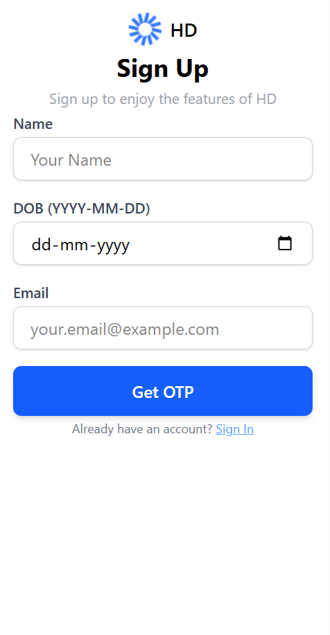
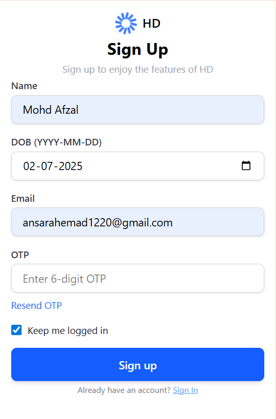
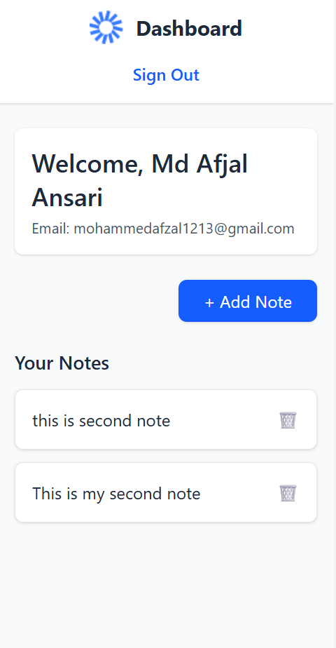
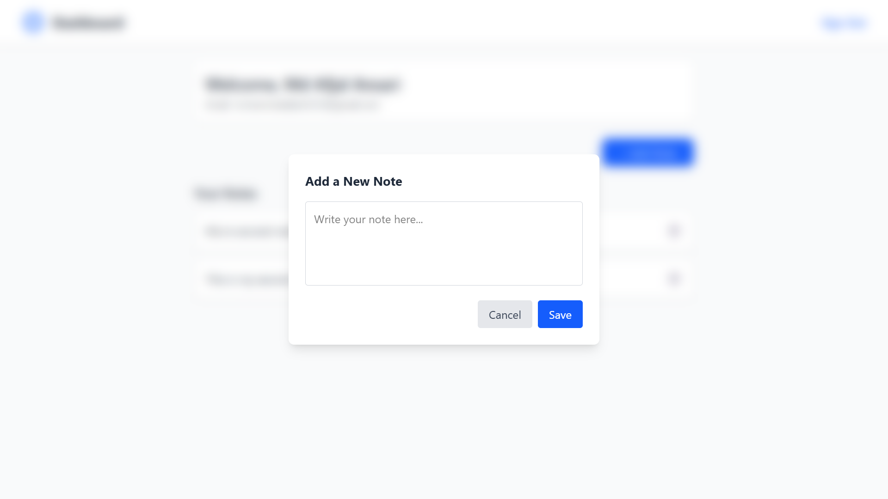
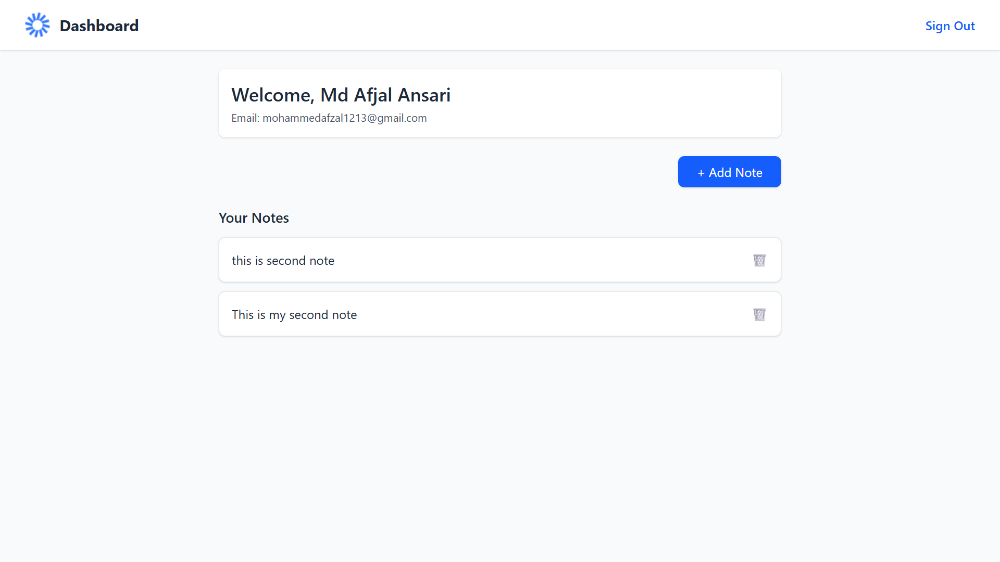
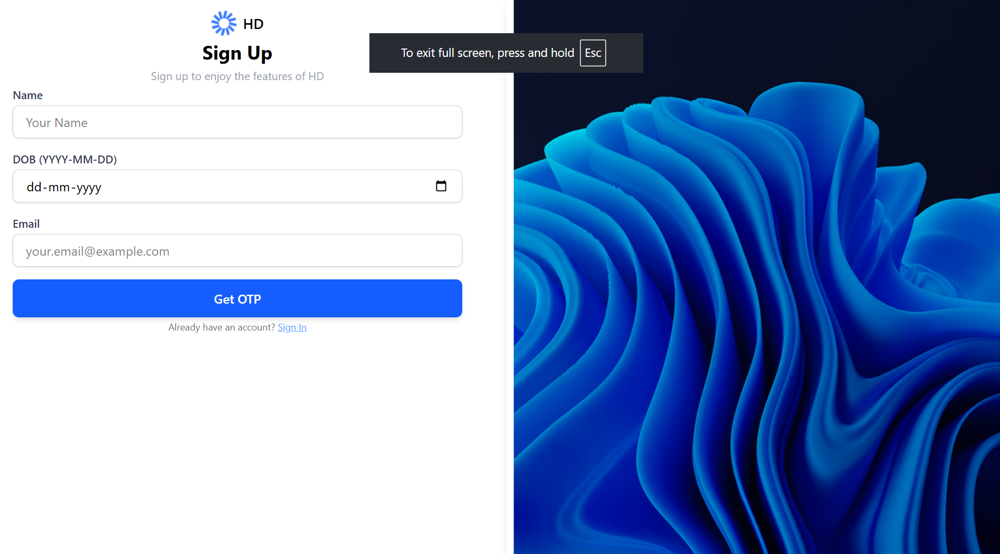

# 📝 Highway Notes – OTP-Based Notes App

Welcome to **Highway Notes**, a secure and minimal **MERN-based** notes application with **OTP email authentication** and JWT-protected APIs.

---

## 🔐 Features

- ✉️ OTP-based Sign-Up and Sign-In via email
- 🔒 JWT Authentication
- 🧑‍💻 Protected Note Creation & Deletion
- 💌 Email support via **Nodemailer**
- 🌐 Built with **React + Express + MongoDB**
- ⚙️ Clean & responsive Tailwind CSS UI

---

## 🖼️ Preview Screens

| Sign Up | Email OTP | Dashboard |
|--------|-----------|-----------|
|  |  |  |

| Add Note | Notes List | Responsive Design |
|----------|------------|-------------------|
|  |  |  

> 💡 All screenshots are stored in the `screenshots/` folder. You can add your own custom previews there.

---
## 🚀 Getting Started

Follow these instructions to set up both backend and frontend locally.

---

### 📦 Backend Setup

1. Navigate to the backend directory:

   ```bash
   cd backend
   npm i
   npm start
### 📦 frontend Setup

2. Navigate to the frontend directory:

   ```bash
   cd frontend
   npm i
   npm run dev
### 📦 .env Setup
```PORT=1400
MONGO_URI=your_mongodb_connection_string
jwt_secret=your_jwt_secret
user=your_email@example.com
pass=your_email_app_password

---
###📁 Project Structure

```highway-notes/
├── backend/
│   ├── server.js                 # Main Express server
│   ├── utils/
│   │   └── otpEmailSender.js     # Function to send OTP emails via Nodemailer
│   └── .env                      # Environment variables for backend config
│
├── frontend/
│   ├── src/
│   │   ├── pages/
│   │   │   ├── Home.jsx          # Sign-Up / Sign-In Page
│   │   │   └── Dashboard.jsx     # User dashboard with notes
│   │   ├── context/
│   │   │   └── globalContext.js  # Global state management with Context API
│   │   └── App.jsx               # Main app routing component
│   └── index.html                # Vite entry file
│
├── screenshots/                  # All preview images for README
│   ├── signup.png
│   ├── otp-verification.png
│   ├── dashboard.png
│   └── ... (rest of screenshots)
│
├── README.md                     # This file
└── package.json                  # (optional if monorepo is used)

---


